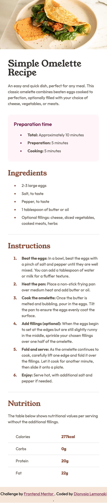
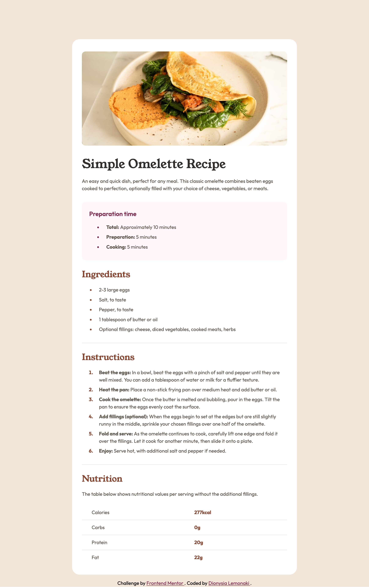

# Frontend Mentor - Recipe page solution

This is a solution to the [Recipe page challenge on Frontend Mentor](https://www.frontendmentor.io/challenges/recipe-page-KiTsR8QQKm).

## Table of contents

- [Overview](#overview)
  - [Screenshot](#screenshot)
  - [Links](#links)
- [My process](#my-process)
  - [Built with](#built-with)
- [Author](#author)

## Overview

### Screenshot

Mobile view:

Desktop view:

### Links

- [Solution URL](https://www.frontendmentor.io/solutions/recipe-page-i07VEicyFn)
- [Live site URL](https://fem-recipe-page-tan.vercel.app/)

## My process

### Built with

- Semantic HTML5 markup
- CSS custom properties
- Mobile-first workflow

## Author

- [Frontend Mentor profile](https://www.frontendmentor.io/profile/dionysia-lemonaki)
- [LinkedIn](https://www.linkedin.com/in/dionysia-lemonaki-developer/)

